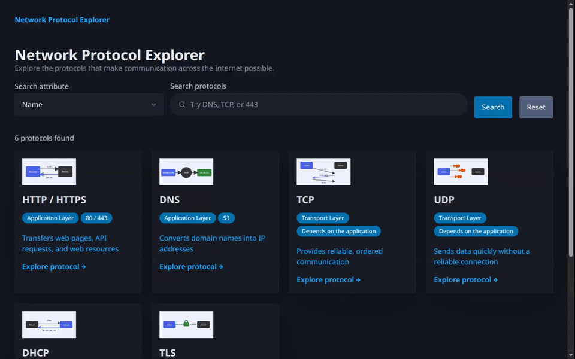

# WEB103 Project 2 - *Network Protocol Explorer*

Submitted by: **Kavya Gautam**

About this web app: **A database-backed field guide to six Internet protocols. Browse illustrated cards, explore detailed explanations, and search by name, layer, transport, or port. Refactored from my Unit 1 project using vanilla JavaScript, Express, and Render PostgreSQL.**

Time spent: **1** hour

## Required Features

The following **required** functionality is completed:

- [x] **The web app uses only HTML, CSS, and JavaScript without a frontend framework**
- [x] **The web app is connected to a PostgreSQL database, with an appropriately structured database table for the list items**
  - [x] **NOTE: Your walkthrough added to the README must include a view of your Render dashboard demonstrating that your Postgres database is available**
  - [x] **NOTE: Your walkthrough added to the README must include a demonstration of your table contents. Use the psql command 'SELECT * FROM tablename;' to display your table contents.**

The following **optional** features are implemented:

- [x] The user can search for items by a specific attribute

The following **additional** features are implemented:

- [x] Individual protocol pages with use cases and examples
- [x] Responsive cards, labeled search controls, keyboard focus, and live result counts
- [x] Loading, empty, error/retry, and missing-protocol states
- [x] Parameterized SQL, transactional repeatable seeds, and database health endpoint

## Video Walkthrough

Here's a walkthrough of implemented required features:



GIF created with T3 collaborative browser recording and FFmpeg.

[Full table contents from Render PostgreSQL](docs/table-contents.txt)

## Notes

Live app: https://protocol-explorer.onrender.com

The frontend fetches `/api/protocols` and `/api/protocols/:slug`. Every list and detail response comes from the Render PostgreSQL `protocols` table; there is no in-memory data fallback. The schema stores identifiers, names, layer, transport, ports, purpose, description, use cases (`TEXT[]`), example, and image path. Original SVG illustrations and protocol content are retained from Unit 1.

The walkthrough's table view displays actual captured output from `psql -x -c 'SELECT * FROM protocols;'` against the Render database. Credentials are excluded from git and recording. TLS certificate validation is enabled.

Free Render hosting can take about a minute to wake after inactivity. The free database expires November 3, 2026.

### Run locally

Requires Node.js 20+ and PostgreSQL (or the Render external connection URL).

```bash
npm ci
cp .env.example .env
# Set DATABASE_URL in .env; use PGSSLMODE=require for Render.
npm run db:seed
npm start
```

### Deploy to Render

Use `render.yaml` as a Render Blueprint. It creates the free PostgreSQL database and Node web service, sets `DATABASE_URL` from the database, and runs the schema/seed before starting the app. No credentials belong in source control.

### Validation

```bash
npm test
```

Six tests cover parameterized attribute search, invalid attributes, missing protocols, database health failures, transactional seeding, and rollback. Browser verification covers desktop/mobile layouts, search, detail navigation, empty results, reset, and missing protocols.

## License

Copyright 2026 Kavya Gautam

Licensed under the Apache License, Version 2.0 (the "License"); you may not use this file except in compliance with the License. You may obtain a copy of the License at

> http://www.apache.org/licenses/LICENSE-2.0

Unless required by applicable law or agreed to in writing, software distributed under the License is distributed on an "AS IS" BASIS, WITHOUT WARRANTIES OR CONDITIONS OF ANY KIND, either express or implied. See the License for the specific language governing permissions and limitations under the License.
